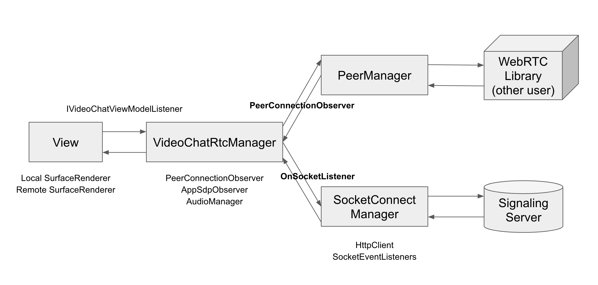
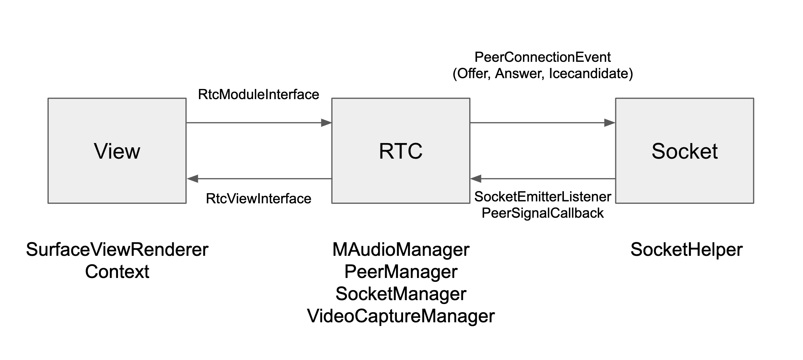

# Android WebRTC Demo

안드로이드 앱에서 WebRTC를 사용하면서 알게된 지식을 정리해봤습니다. 이후 이 내용을 바탕으로 데모 앱을 만들어 간단히 두 안드로이드 스마트폰이 화상으로 통신하는 서비스를 개발하였습니다

ℹ️릴리즈 노트 및 이슈 트래킹은 [WebRTC](http://webrtc.github.io/webrtc-org/) 웹 페이지를 참조하세요.

## 0. Demo Video.

## 1. Summary
1. 상대방과 offer / answer 를 주고받고, Ice Candidates를 주고받은 후 둘이서 P2P direct 통신을 합니다.
2. (1) 번 과정은 [소켓 통신을 통해서 이루어집니다.
3. WebRTC를 사용하는 중 발생하는 소켓 통신을 도식화한 간단한 이미지를 첨부합니다.

## 2. Architecture

### Overview
1. 이 데모 앱은 [WebRTC 가이드라인](http://webrtc.github.io/webrtc-org/native-code/android/) 에서 제공하는 사전 빌드된 라이브러리를 사용합니다.
2. RTC 모듈 내부에서도, PeerConnection을 담당하는 Manager, Socket 통신을 담당하는 Manager 등을 나누었습니다.
3. FaceChatRtcManager를 통해서 화상 채팅을 직접 구현할 수 있습니다.
4. 시그널링 서버, turn / coturn 과 같은 서버 스펙은 이 repository에는 없습니다. 관련 다른 레포를 찾아보세요.

### Structure

1. View -> RtcManager 통신
    - 데모 앱은 ViewModel이 RtcManager를 관리하는 형태로 작성하였습니다.
    - SurfaceView를 RtcManager에 등록시켜주면, RtcManager는 그 view를 초기화시키고, 카메라를 캡쳐하여 렌더링해줍니다.
    - 뷰는 자신의 생명주기에 맞게 RtcManager에 있는 메소드를 호출합니다 (*initialize, attach, destroy 등등..*)
    - RtcManager를 생성할 때, IVideoChatViewModelListener 인터페이스의 생성자를 넣어줘야 합니다.

2. RtcManager -> View 통신
    - IVideoChatViewModelListener 인터페이스를 통해 RTC 이벤트를 뷰에 전달합니다.
    - 따라서 뷰 혹은 뷰모델 레이어의 클래스는 IVideoChatViewModelListener를 구현해야 합니다.

3. RtcManager <-> PeerManager 간 통신
    - 명시적으로 해줘야 하는 작업 없이, WebRTC 라이브러리에서 제공하는 메소드를 그대로 호출합니다.

4. RtcManager <-> SocketConnect 간 통신
    - 만약 여러분의 서비스가 시그널링 서버를 통한 커스텀 소켓 이벤트를 구현하고 싶다면, SocketEventListener 혹은 별도의 인터페이스를 만들어 통신하세요.
    - 데모 앱은 두 사용자를 매칭시켜주는 이벤트에서 데이터를 주고받기 위해 커스텀 이벤트를 구현했습니다.

#### 구 버전 (2020.07.10 릴리즈)

펼쳐보기

1. View <-> RTC 모듈 간 통신
	- 안드로이드 app 모듈에 xml로 선언된 SurfaceViewRenderer를 RTC 모듈에 넘겨줍니다.
	- 이렇게 넘어간 SurfaceViewRenderer는 RTC의 VideoStream, AudioStream을 구성합니다.
	- app 모듈에서는 [RtcModuleInterface](https://github.com/skfo763/WebRTC-android-example/blob/master/rtc/src/main/java/com/skfo763/rtc/contracts/RtcModuleInterface.kt)를 통해서 RTC 모듈을 제어합니다.
	- rtc 모듈에서는 자신의 작업이 완료되었다는 것을 [RtcViewInterface](https://github.com/skfo763/WebRTC-android-example/blob/master/rtc/src/main/java/com/skfo763/rtc/contracts/RtcViewInterface.kt)를 통해 app에 전달합니다.
2. RTC <-> Socket 간 통신
    - 사전 정의된 offer / answer / icecandidate의 경우 별도의 소켓 통신 처리를 해주지 않아도 rtc 라이브러리가 알아서 데이터를 교환합니다.
    - 각 서비스마다 독자적으로 화상 통화 중 특정 이벤트를 발행 및 수신하게 만들고 싶다면, RTC와 socket 사이의 인터페이스를 통해서 주고받습니다.

### Details
#### Property
1. localVideoSource : 로컬 카메라가 촬영하는 비디오 트랙의 생성 등을 관리
~~~
private val localVideoSource by lazy {
	peerConnectionFactory.createVideoSource(false)
}
~~~
2.  localVideoTrack : 로컬 카메라가 촬영하는 비디오 스트림을 갖고 있음
~~~
private val localVideoTrack by lazy {
	peerConnectionFactory.createVideoTrack(VIDEO_TRACK_ID, localVideoSource)
}
~~~
3. surfaceTextureHelper : 로컬 카메라가 촬영하는 영상의 텍스쳐 (질감, 색감 등등) 을 담당
~~~
surfaceTextureHelper = SurfaceTextureHelper.create(Thread.currentThread().name, rootEglBase.eglBaseContext)
~~~
4. localStream : 내 오디오/비디오 트랙을 상대방에게 보낼 때 이 localStream에 담아서 보내준다.
~~~
val localStream: MediaStream by lazy {
	peerConnectionFactory.createLocalMediaStream(LOCAL_STREAM_ID)
}
~~~
5. videoCaptureManager : Camera2 / Camera1, front / back facing 관련 처리 담당해줌
~~~
private val videoCaptureManager = VideoCaptureManager.getVideoCapture(context)
~~~
6. peerConnection : 상대방과 주고받는 데이터
~~~
protected fun buildPeerConnection(): PeerConnection? {
  val rtcConfig = PeerConnection.RTCConfiguration(iceServer).apply {
  /* TCP candidates are only useful when connecting to a server that supports. ICE-TCP. */
  iceTransportsType = PeerConnection.IceTransportsType.RELAY
        tcpCandidatePolicy = PeerConnection.TcpCandidatePolicy.DISABLED
        bundlePolicy = PeerConnection.BundlePolicy.MAXBUNDLE
        rtcpMuxPolicy = PeerConnection.RtcpMuxPolicy.REQUIRE
        continualGatheringPolicy = PeerConnection.ContinualGatheringPolicy.GATHER_CONTINUALLY
        /* Enable DTLS for normal calls and disable for loopback calls. */
		enableDtlsSrtp = true
		// sdpSemantics = PeerConnection.SdpSemantics.UNIFIED_PLAN
	    /* Use ECDSA encryption. */ // keyType = PeerConnection.KeyType.ECDSA  }

  return peerConnectionFactory.createPeerConnection(rtcConfig, observer) ?: kotlin.run {
	  observer.onPeerError(isCritical = true, showMessage = false, message = PEER_CREATE_ERROR)
	  null
  }
}
~~~

#### PeerConnection 연결 순서
**--- 액티비티 생성 ---**
1. localStream, localVideoTrack, videoCaptureManager 초기화
2. localStream에 localVideoTrack을 추가
3. surfaceTextureHelper, localVideoSource 초기화
4. videoCaptureManager.initialize() 메소드 호출 -> 로컬 카메라 촬영 준비 완료
5. 로컬 카메라 촬영 시작

**--- 인트로 ---**

6. sv_face_chat_intro_preview에 localVideoTrack 추가 -> 이 때부터 인트로 서페이스뷰에 에 내 모습이 띄워짐.

**--- 매칭 대기 ---**

7. sv_face_chat_waiting_local에 localVideoTrack 추가 -> 이 때부터 대기화면 서페이스뷰에 에 내 모습이 띄워짐.
8. iceServer 주소 값 초기화
9. peerConnection 초기화
10. peerConnection에 localStream을 연결

**--- 통화 중 진입 ---**

11. sv_face_chat_call_local에 localVideoTrack 추가  -> 이 때부터 통화화면 작은 서페이스뷰에 에 내 모습이 띄워짐.

**--- onAddStream() 메소드 호출 : 피어 연결 완료---**

12. sv_face_chat_call_remote에 상대방의 remoteVideoTrack을 추가 -> 이 때부터 상대방 모습이 띄워짐.

**--- 통화 종료 ---**

13. peerConnection 닫고, null로
14. 종료 로직에 따라 다름
	- 스와이핑 시 : 7번 순서부터 다시 진행
	- 취소 버튼 누르고 종료 시 : 6번 순서부터 다시 진행

**--- 서비스 종료 ---**

15. peerConnection이 살아있다면, 거기서 localStream 제거
16. localStream에서 localVideoTrack 제거
17. 로컬 카메라 촬영 종료
18. localVideoSource 사용 종료
19. videoCaptureManager null로
