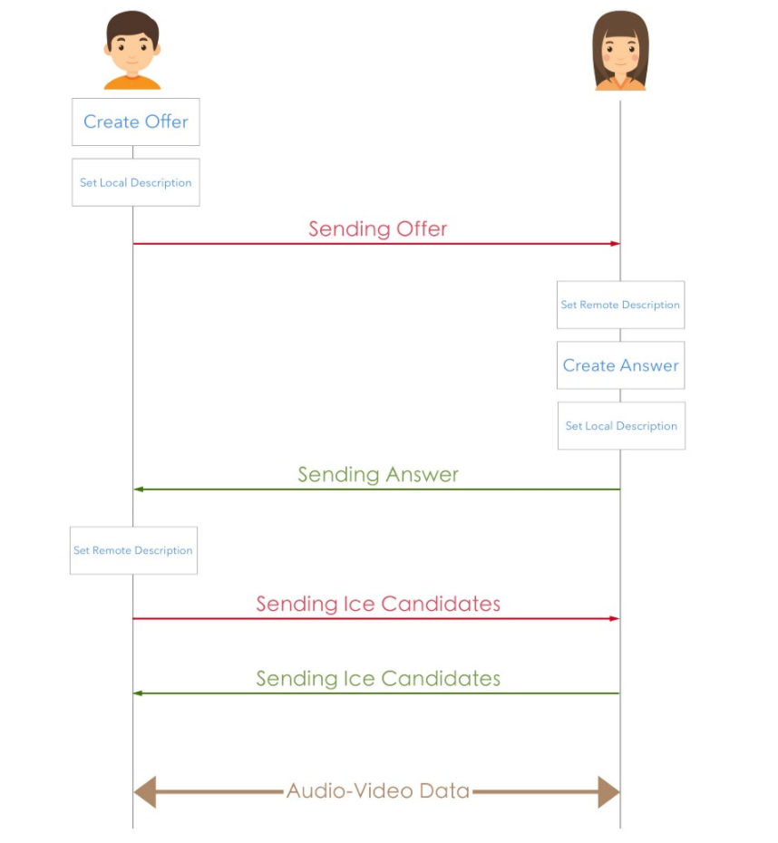

# Android WebRTC Demo

Warning : This repository is still developing now, and not completed.

안드로이드 앱에서 WebRTC를 사용하면서 알게된 지식을 정리해봤습니다. 이후 이 내용을 바탕으로 데모 앱을 만들어 간단히 두 안드로이드 스마트폰이 화상으로 통신하는 서비스를 개발하였습니다

ℹ️릴리즈 노트 및 이슈 트래킹은 [WebRTC](http://webrtc.github.io/webrtc-org/) 웹 페이지를 참조하세요.

## 0. Demo Video.

## 1. Summary
1. 상대방과 offer / answer 를 주고받고, Ice Candidates를 주고받은 후 둘이서 P2P direct 통신을 합니다.
2. (1) 번 과정은 [소켓 통신을 통해서 이루어집니다.
3. WebRTC를 사용하는 중 발생하는 소켓 통신을 도식화한 간단한 이미지를 첨부합니다.

## 2. Architecture

### Overview
1. 이 데모 앱은 [WebRTC 가이드라인](http://webrtc.github.io/webrtc-org/native-code/android/) 에서 제공하는 사전 빌드된 라이브러리를 사용합니다.
2. Socket 통신부분과 RTC 관련 로직을 모듈로 분리하였습니다.
3. RTC 모듈 내부에서도, PeerConnection을 담당하는 Manager, Socket 통신을 담당하는 Manager 등을 나누었습니다.
4. VideoChatRtcManager 클래스를 추가해서 화상채팅도 지원할 수 있도록 기능 확장할 예정입니다.

### Summary

1. View <-> RTC 모듈 간 통신
	- 안드로이드 app 모듈에 xml로 선언된 SurfaceViewRenderer를 RTC 모듈에 넘겨줍니다.
	- 이렇게 넘어간 SurfaceViewRenderer는 RTC의 VideoStream, AudioStream을 구성합니다.
	- app 모듈에서는 [RtcModuleInterface](https://github.com/skfo763/WebRTC-android-example/blob/master/rtc/src/main/java/com/skfo763/rtc/contracts/RtcModuleInterface.kt)를 통해서 RTC 모듈을 제어합니다.
	- rtc 모듈에서는 자신의 작업이 완료되었다는 것을 [RtcViewInterface](https://github.com/skfo763/WebRTC-android-example/blob/master/rtc/src/main/java/com/skfo763/rtc/contracts/RtcViewInterface.kt)를 통해 app에 전달합니다.
